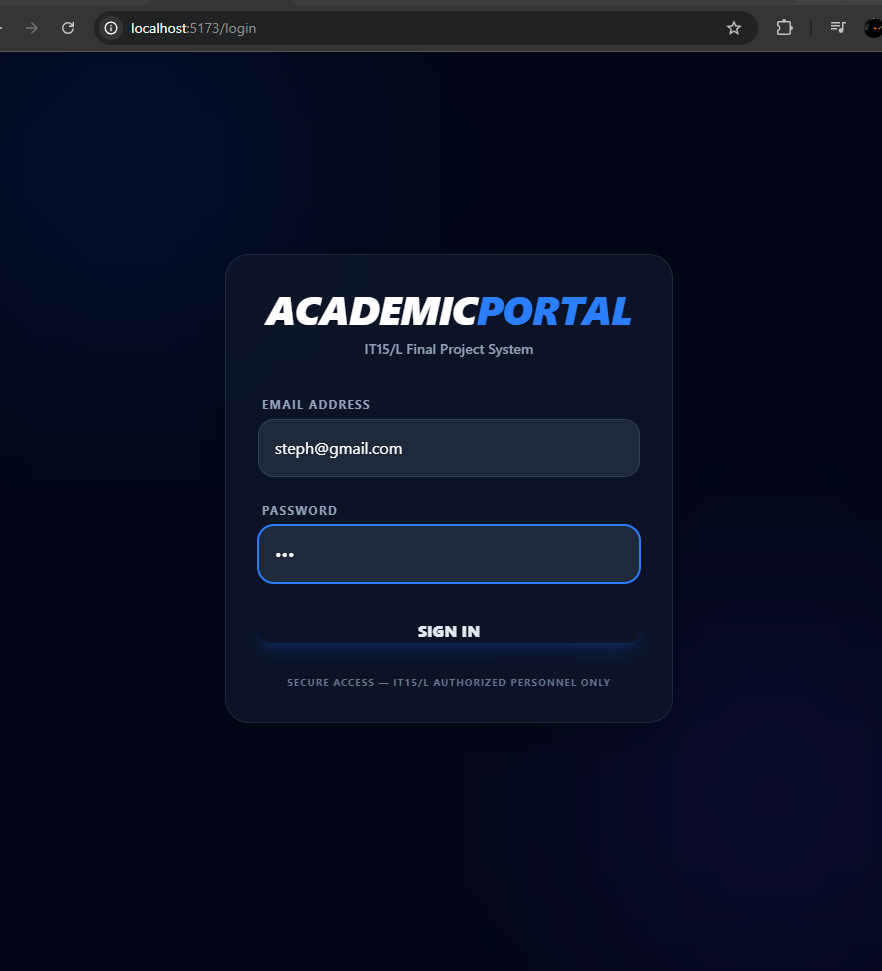
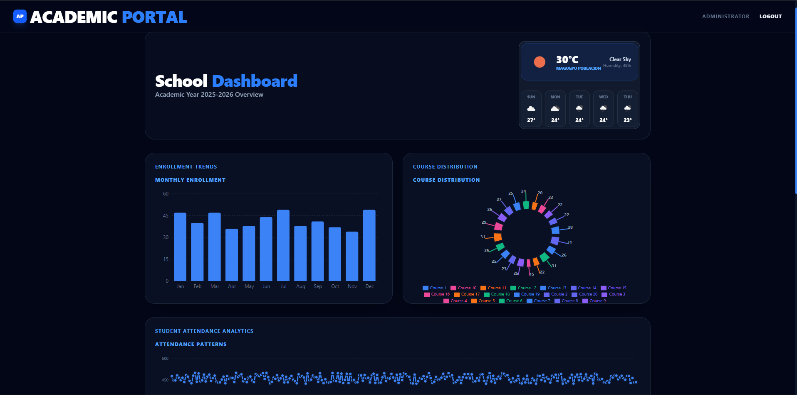
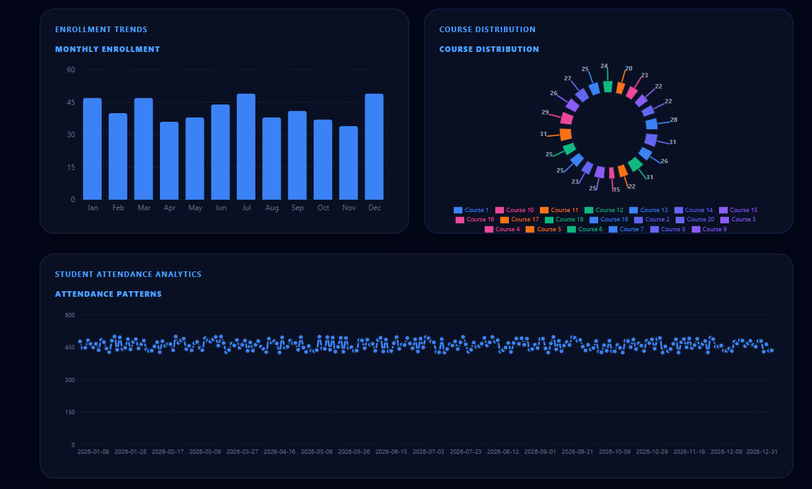
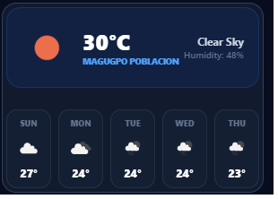
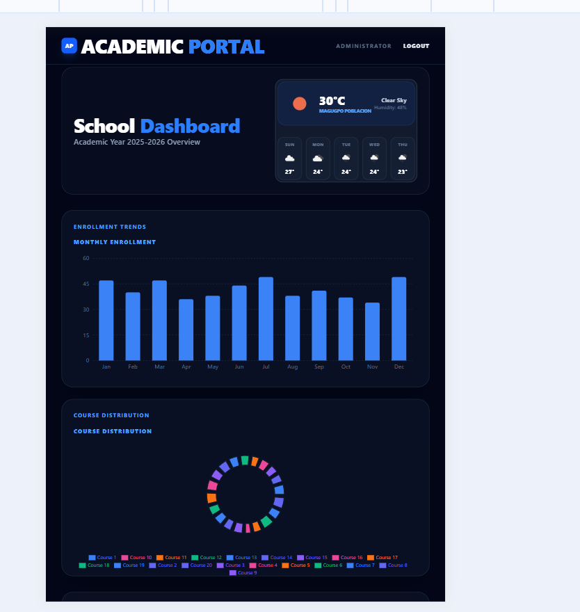

# IT15/L — Integrative Programming Final Project
## Academic Service Management System (Full-Stack)

## 📺 1. Video Demonstration
**Project Walkthrough:** 👉 https://drive.google.com/drive/folders/1-3rr2huyQ4eETJ-z9IbUnIu6VidZGs9Q?usp=drive_link
*This video demonstrates the full system functionality, including authentication and live API integration.*

---

## 📸 2. Project Screenshots
### Secure Login System (Requirement 1.2)

### Dashboard Overview (Requirement 1.3)

### Student Analytics Visualization (Requirement 1.3)

### Tagum City Weather Integration (Requirement 1.4)

### Mobile Responsive Layout (Requirement 3.2)

---

## 📡 3. API Documentation
### Internal Endpoints (Laravel Backend)
| Endpoint | Method | Description | Response |
| :--- | :--- | :--- | :--- |
| `/api/login` | POST | Authenticates user | Bearer Token + User Data |
| `/api/dashboard/stats` | GET | Data for Enrollment/Course charts | JSON Object |
| `/api/students` | GET | List of 500+ student records | JSON Array |

### External Integration (OpenWeatherMap)
* **Status:** Fully Functional
* **Location:** Tagum City, PH
* **Features:** Current temperature, humidity, and 5-day weather forecast with visual icons.

---

## 🚀 4. Technologies Used
* **Frontend:** React.js (v18), Axios, Recharts, Tailwind CSS / Bootstrap.
* **Backend:** Laravel (v10), PHP (v8.2), Laravel Sanctum.
* **Database:** MySQL (v8.0) with 500+ seeded records.
* **External APIs:** OpenWeatherMap API.

---

## 🛠️ 5. Setup Instructions

### Backend Setup (Laravel)
1. `cd laravel-backend`
2. `composer install`
3. `cp .env.example .env` (Configure your database credentials)
4. `php artisan key:generate`
5. `php artisan migrate --seed`
6. `php artisan serve`

### Frontend Setup (React)
1. `cd react-frontend`
2. `npm install`
3. Create a `.env` file and add: `VITE_WEATHER_API_KEY=your_api_key_here`
4. `npm run dev`

---

## 🔐 6. Security & Best Practices
* **Route Protection:** Implemented middleware to protect dashboard routes.
* **Environment Security:** All API keys and sensitive credentials are excluded from Git via `.gitignore`.
* **Responsive Design:** Utilized CSS grid and flexbox to ensure 100% mobile compatibility.
